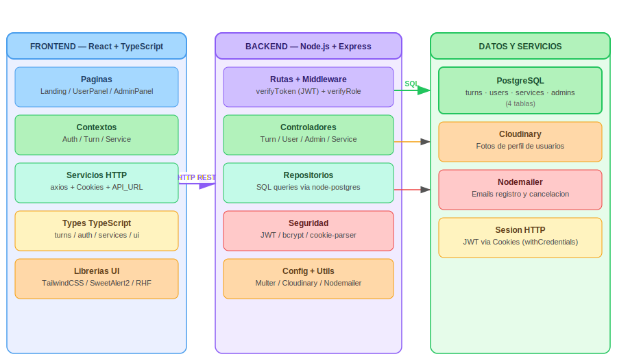
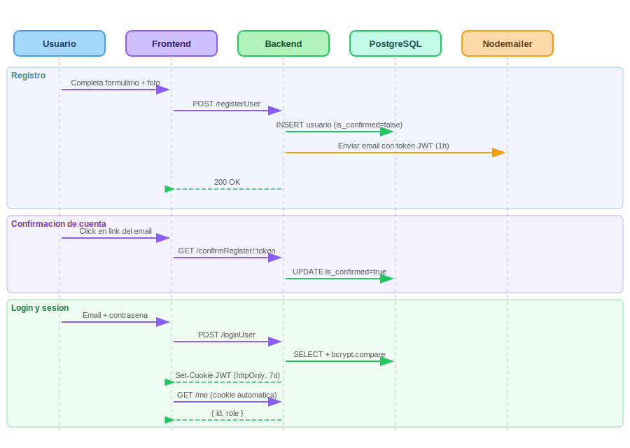
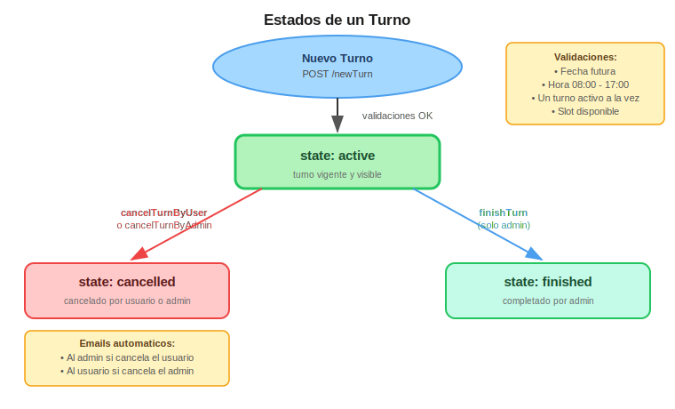

# Barbershop — Sistema de gestión de turnos

Proyecto personal. Sistema web para la gestión de turnos de una barbería. Permite a los usuarios registrarse con foto de perfil, confirmar su cuenta por email, iniciar sesión, reservar turnos y cancelarlos. Los administradores pueden gestionar turnos y servicios desde su panel.

---

## Índice

1. [Stack tecnológico](#stack-tecnológico)
2. [Correr el proyecto](#correr-el-proyecto)
3. [Variables de entorno](#variables-de-entorno)
4. [Arquitectura general](#arquitectura-general)
5. [Roles del sistema](#roles-del-sistema)
6. [Autenticación](#autenticación)
7. [Endpoints](#endpoints)
8. [Rutas del Frontend](#rutas-del-frontend)
9. [Estados de un turno](#estados-de-un-turno)
10. [Funcionalidades implementadas](#funcionalidades-implementadas)
11. [Componentes principales](#componentes-principales)
12. [Types principales](#types-principales-typescript)
13. [Utilidades](#utilidades)
14. [Testing](#testing)

---

## Stack tecnológico

### PERN Stack

| Capa | Tecnología | Versión |
|---|---|---|
| **P**ostgreSQL | Base de datos relacional | 20 |
| **E**xpress | Framework de servidor HTTP | ^5.2.1 |
| **R**eact | Librería de UI | ^19.2.0 |
| **N**ode.js | Runtime del servidor | 22 |

### Frontend adicional

| Tecnología | Uso | Versión |
|---|---|---|
| TypeScript | Tipado estático | ~5.9.3 |
| Vite | Bundler y dev server | ^7.2.4 |
| TailwindCSS | Estilos utilitarios | ^4.1.18 |
| React Router Dom | Navegación SPA | ^7.13.0 |
| React Hook Form | Manejo de formularios | ^7.71.1 |
| Axios | Cliente HTTP | ^1.13.4 |
| SweetAlert2 | Alertas y confirmaciones | ^11.26.24 |
| React Loader Spinner | Indicadores de carga | ^8.0.2 |
| Bootstrap Icons | Iconografía | ^1.13.1 |

### Backend adicional

| Tecnología | Uso | Versión |
|---|---|---|
| jsonwebtoken | Autenticación con JWT | ^9.0.3 |
| bcrypt | Hash de contraseñas | ^6.0.0 |
| cookie-parser | Lectura de cookies HTTP | ^1.4.6 |
| nodemailer | Envío de emails (registro y cancelaciones) | ^7.0.13 |
| cloudinary | Gestión de imágenes (fotos de perfil) | ^2.9.0 |
| multer | Subida de archivos (foto en registro) | ^2.1.1 |
| dotenv | Variables de entorno | ^17.2.3 |
| nodemon | Hot reload en desarrollo | ^3.1.11 |

---

## Correr el proyecto

### Backend
```bash
cd backend
npm install
npm run dev
```

### Frontend
```bash
cd frontend
npm install
npm run dev
```

---

## Variables de entorno

### Backend (`.env`)

```env
PORT=
DB_HOST=
DB_USER=
DB_PASSWORD=
DB_NAME=
DB_PORT=
JWT_SECRET=
EMAIL_USER=
EMAIL_PASSWORD=
EMAIL_ADMIN=
FRONTEND_URL=
NODE_ENV=
CLOUDINARY_CLOUD_NAME=
CLOUDINARY_API_KEY=
CLOUDINARY_API_SECRET=
```

### Frontend (`.env`)

```env
VITE_API_URL=
```

---

## Arquitectura general

```
turnero-pern/
├── backend/
│   ├── __tests__/       # Tests unitarios (Jest)
│   ├── config/          # Conexión DB, Cloudinary, Nodemailer
│   ├── controllers/     # Lógica de cada endpoint
│   ├── middleware/      # verifyToken, verifyRole, multer
│   ├── repository/      # Queries SQL directas a PostgreSQL
│   ├── routes/          # Definición de rutas Express
│   ├── utils/           # formatTurn.js (formatDate, formatTime, isPastDate)
│   └── index.js         # Entry point del servidor
│
└── frontend/
    └── src/
        ├── components/  # Componentes reutilizables (layout y ui)
        ├── context/     # AuthContext, TurnContext, ServiceContext
        ├── hooks/       # useAuth, useDashboardUser, useDashboardAdmin, useTurns, useServices
        ├── pages/       # Vistas principales
        ├── services/    # Llamadas HTTP con axios
        ├── types/       # Interfaces TypeScript centralizadas
        └── utils/       # Funciones utilitarias (formatTurn)
```

### Diagrama de arquitectura



---

## Roles del sistema

| Rol | Acceso |
|---|---|
| `user` | Registro, login, reservar, ver y cancelar sus propios turnos |
| `admin` | Login, ver todos los turnos activos, gestión de servicios |

---

## Autenticación

- Basada en **JWT almacenado en cookie `httpOnly`** (no accesible desde JavaScript)
- Al cargar la app, el frontend llama a `GET /me` para restaurar la sesión desde la cookie
- La cookie de sesión expira en **7 días**
- La confirmación de cuenta se realiza por **email** con un token JWT de **1 hora**

### Flujo de autenticación



### Protección de rutas

**Frontend** — componente `VerifyAuth` y `useEffect` en cada panel:
- Sin sesión → redirige a `/`
- Role incorrecto → redirige al panel correspondiente

**Backend** — middlewares encadenados en cada ruta:
- `verifyToken` → valida el JWT de la cookie
- `verifyRole(role)` → valida que el role coincida con el endpoint requerido

---

## Endpoints

### Auth

| Método | Ruta | Descripción | Protección |
|---|---|---|---|
| `GET` | `/me` | Restaura sesión desde la cookie | `verifyToken` |

### Usuarios

| Método | Ruta | Descripción | Protección |
|---|---|---|---|
| `POST` | `/registerUser` | Registra un usuario con foto de perfil (multipart/form-data) | Pública |
| `GET` | `/confirmRegister/:token` | Confirma el registro por email | Pública |
| `POST` | `/loginUser` | Inicia sesión del usuario | Pública |
| `POST` | `/logout` | Cierra sesión y limpia la cookie | Pública |
| `GET` | `/dashboardUser` | Devuelve los datos del perfil del usuario | `verifyToken` |

### Administrador

| Método | Ruta | Descripción | Protección |
|---|---|---|---|
| `POST` | `/loginAdmin` | Inicia sesión del administrador (username + password) | Pública |
| `GET` | `/dashboardAdmin` | Devuelve los datos del admin | `verifyToken` + `verifyRole("admin")` |

### Turnos

| Método | Ruta | Descripción | Protección |
|---|---|---|---|
| `POST` | `/newTurn` | Crea un nuevo turno | `verifyToken` + `verifyRole("user")` |
| `GET` | `/userTurns` | Lista todos los turnos del usuario (activos e historial) | `verifyToken` + `verifyRole("user")` |
| `GET` | `/activeTurn` | Devuelve el próximo turno activo del usuario | `verifyToken` + `verifyRole("user")` |
| `GET` | `/adminTurns` | Lista todos los turnos activos con datos del usuario | `verifyToken` + `verifyRole("admin")` |
| `GET` | `/allAdminTurns` | Lista el historial completo de turnos (cancelados y finalizados) | `verifyToken` + `verifyRole("admin")` |
| `PATCH` | `/cancelTurnByUser/:turnId` | Cancela el turno del usuario y notifica al admin por email | `verifyToken` + `verifyRole("user")` |
| `PATCH` | `/cancelTurnByAdmin/:turnId` | Cancela un turno con motivo y notifica al usuario por email | `verifyToken` + `verifyRole("admin")` |
| `PATCH` | `/finishTurn/:turnId` | Marca un turno activo como finalizado | `verifyToken` + `verifyRole("admin")` |

### Servicios

| Método | Ruta | Descripción | Protección |
|---|---|---|---|
| `GET` | `/services` | Lista todos los servicios activos | `verifyToken` |
| `POST` | `/services` | Crea un nuevo servicio | `verifyToken` + `verifyRole("admin")` |
| `DELETE` | `/services/:id` | Elimina un servicio (soft delete) | `verifyToken` + `verifyRole("admin")` |

### Validaciones al crear un turno

- La fecha debe ser **posterior a hoy**
- El horario debe estar entre **08:00 y 18:00**
- El usuario no puede tener **más de un turno activo** a la vez
- El slot de fecha y hora no puede estar **ya reservado**

---

## Rutas del Frontend

| Ruta | Componente | Acceso |
|---|---|---|
| `/` | `Landing` | Pública |
| `/ingreso-usuario` | `LoginUser` | Pública |
| `/registro-usuario` | `RegisterUser` | Pública |
| `/confirmar/:token` | `ConfirmedUser` | Pública |
| `/ingreso-admin` | `LoginAdmin` | Pública |
| `/panel-usuario` | `UserPanel` | Protegida (`user`) |
| `/panel-admin` | `AdminPanel` | Protegida (`admin`) |
| `/nuevo-turno` | `NewTurn` | Protegida (`user`) |

---

## Estados de un turno



---

## Funcionalidades implementadas

### Usuarios
- [x] Registro con foto de perfil (subida a Cloudinary) y confirmación por email
- [x] Login con email y contraseña
- [x] Logout
- [x] Dashboard con datos del perfil (nombre, apellido, email, teléfono, foto)
- [x] Reservar turno (con validación de fecha futura, horario y turno activo único)
- [x] Ver turno activo (próximo turno reservado)
- [x] Ver historial de todos los turnos propios
- [x] Cancelar turno activo (con notificación por email al admin)

### Administrador
- [x] Login con username y contraseña
- [x] Dashboard con datos del admin
- [x] Ver todos los turnos activos (con datos del usuario: nombre, apellido, teléfono, foto)
- [x] Ver historial completo de turnos (cancelados y finalizados)
- [x] Buscar en el historial por nombre o apellido del usuario (filtrado en tiempo real, client-side)
- [x] Cancelar turno con motivo de cancelación (modal + email automático al usuario)
- [x] Finalizar turno activo
- [x] Crear servicios (nombre, descripción, duración, precio)
- [x] Listar servicios activos
- [x] Eliminar servicios (soft delete)

---

## Componentes principales

### Layout

| Componente | Descripción |
|---|---|
| `Header` | Navegación fija con logo, links y botones de auth; menú hamburguesa responsive |
| `Landing` | Wrapper que combina `Header` + `Home` |
| `HeaderDashboardUser` | Cabecera del panel de usuario con foto, nombre y botón de logout |
| `HeaderDashboardAdmin` | Sidebar del admin con 3 opciones de navegación y logout |

### Turnos

| Componente | Descripción |
|---|---|
| `ActiveTurn` | Muestra el próximo turno activo con fecha formateada y botón de cancelación |
| `UserTurnsCard` | Card individual de turno en el historial del usuario |
| `TurnsHistoryTable` | Tabla de historial de turnos del usuario (cancelados y finalizados) |
| `AdminTurnCard` | Card de turno activo para el admin con foto, datos del usuario y acciones (cancelar/finalizar) |
| `AllAdminTurnCard` | Card de turno del historial del admin (incluye estado y motivo de cancelación) |
| `CancelTurnModal` | Modal para que el admin ingrese el motivo de cancelación (máx. 200 chars) |

### Servicios

| Componente | Descripción |
|---|---|
| `ServiceCard` | Card de servicio con nombre, descripción, duración, precio y botón de eliminar |

### Auth y UI

| Componente | Descripción |
|---|---|
| `VerifyAuth` | Guard de ruta; valida el token y redirige a home si no está autenticado |
| `Loader` | Spinner de carga |
| `GoBack` | Botón de retroceso |

---

## Types principales (TypeScript)

### `auth.types.ts`

| Interface | Descripción |
|---|---|
| `RegisterUserData` | Datos del formulario de registro: `name`, `surname`, `email`, `password`, `phone`, `photo: FileList` |
| `LoginUserData` | Datos del login de usuario: `email`, `password` |
| `LoginAdminData` | Datos del login de admin: `username`, `password` |
| `Session` | Sesión en contexto: `{ id, role }` |
| `User` | Datos del perfil del usuario en el dashboard: `id`, `role?`, `name?`, `surname?`, `phone?`, `email?`, `photo?` |
| `Admin` | Datos del admin en el dashboard: `id`, `role` |
| `RegisterUserResponse` | Respuesta de `POST /registerUser` |
| `LoginUserResponse` | Respuesta de `POST /loginUser` |
| `LoginAdminResponse` | Respuesta de `POST /loginAdmin` |
| `DashboardUserResponse` | Respuesta de `GET /dashboardUser` |
| `DashboardAdminResponse` | Respuesta de `GET /dashboardAdmin` |

### `turns.types.ts`

| Interface | Descripción |
|---|---|
| `TurnsUser` | Turno del usuario: `id`, `date_turn`, `time_turn`, `notes`, `cancel_reason`, `state?`, `service_name` |
| `TurnsAdmin` | Extiende `TurnsUser` con: `user_name`, `user_surname`, `user_phone`, `user_photo` |
| `TurnsAdminAll` | Alias de `TurnsAdmin` — usado para el historial completo (state incluido) |
| `ActiveTurn` | Próximo turno activo del usuario: `id`, `date_turn`, `time_turn`, `notes`, `service_name` |
| `NewTurnData` | Datos para crear un turno: `date`, `time`, `service: number`, `notes?` |
| `NewTurnResponse` | Respuesta de `POST /newTurn` |
| `TurnsUserResponse` | Respuesta de `GET /userTurns`: `{ turns: TurnsUser[] }` |
| `TurnsAdminResponse` | Respuesta de `GET /adminTurns`: `{ turns: TurnsAdmin[] }` |
| `TurnsAdminAllResponse` | Respuesta de `GET /allAdminTurns`: `{ turns: TurnsAdminAll[] }` |
| `ActiveUserTurnResponse` | Respuesta de `GET /activeTurn`: `{ activeTurn: ActiveTurn \| null }` |
| `ActiveTurnProps` | Props del componente `ActiveTurn`: `turn: ActiveTurn \| null`, `cancelTurnByUser: () => void` |
| `AdminTurnProps` | Props del componente `AdminTurnCard`: `turn: TurnsAdmin` |
| `AllAdminTurnProps` | Props del componente `AllAdminTurnCard`: `turn: TurnsAdminAll` |
| `UserTurnsCardProps` | Props del componente `UserTurnsCard`: `turn: TurnsUser` |
| `TurnsHistoryTableProps` | Props del componente `TurnsHistoryTable`: `turns: TurnsUser[]` |

> `TurnContext` expone `searchTurnsByUser(query: string): TurnsAdminAll[]` — filtra `allTurnsAdmin` por nombre y apellido (case-insensitive, client-side).

### `services.types.ts`

| Interface | Descripción |
|---|---|
| `Service` | Servicio: `id`, `name`, `description`, `duration`, `price` |
| `NewServiceData` | Datos para crear un servicio: `name`, `description`, `duration`, `price` |
| `ServicesResponse` | Respuesta de `GET /services` |
| `NewServiceResponse` | Respuesta de `POST /services` |
| `ServiceDeleteResponse` | Respuesta de `DELETE /services/:id` |

### `ui.types.ts`

| Type / Interface | Descripción |
|---|---|
| `LoadingState` | Estados de carga por operación: `register`, `login`, `dashboard`, `confirm`, `adminTurns`, `allAdminTurns`, `userTurns`, `createTurn`, `createService`, `fetchServices`, `cancelTurnByUser` |
| `AdminPanelView` | Union type para las vistas del panel admin: `"turns" \| "services" \| "newService" \| "allTurns"` |
| `HeaderDashboardAdminProps` | Props del header del admin: `selected: AdminPanelView` y `onSelect` para cambiar la vista |
| `ScheduleRowProps` | Props de una fila del horario en la landing: `day`, `hours`, `open`, `isLast` |
| `ServiceItemProps` | Props de un ítem de servicio en la landing: `icon`, `title`, `desc` |

---

## Utilidades

### `formatTurn.ts` (frontend) y `formatTurn.js` (backend)

Ambas capas usan el mismo conjunto de utilidades de formato:

| Función | Descripción |
|---|---|
| `formatTime(raw)` | Extrae `HH:MM` de un string de tiempo — elimina los segundos |
| `formatDate(raw)` | Formatea a fecha larga en español, ej: `"lunes, 24 de marzo de 2025"` (zona `America/Argentina/Buenos_Aires`) |
| `formatDateLong(raw)` | (frontend) igual que `formatDate` — para mostrar en componentes |
| `formatDateShort(raw)` | (frontend) Formatea a `"Lun, 24 mar"` (es-AR) |
| `isPastDate(dateStr)` | Verifica si una fecha es anterior a hoy (zona `America/Argentina/Buenos_Aires`) — usada en validación del backend |

---

## Testing

El backend cuenta con tests unitarios escritos con **Jest** y **Babel** (para soporte de ESModules). Ningún test toca la base de datos real ni servicios externos — todo se mockea.

### Stack de testing

| Herramienta | Rol |
|---|---|
| `jest` | Framework de testing |
| `babel-jest` + `@babel/preset-env` | Transpila ESModules a CommonJS para que Jest pueda ejecutarlos |
| `babel.config.cjs` | Configuración de Babel (`.cjs` porque el proyecto usa `"type": "module"`) |

### Correr los tests

```bash
cd backend
npm test
```

### Cobertura: 50 tests en 5 suites

| Suite | Cubre | Tests |
|---|---|---|
| `auth-controller.test.js` | Endpoint `GET /me` | 3 |
| `auth-middleware.test.js` | `verifyToken` y `verifyRole` | 7 |
| `user-controller.test.js` | Registro, login, confirmación, dashboard, logout | 14 |
| `admin-controller.test.js` | Login y dashboard del admin | 5 |
| `turn-controller.test.js` | Toda la gestión de turnos | 21 |

#### Detalle por suite

**`auth-controller.test.js`**
- 200 con `id` y `role` cuando `req.user` existe
- 401 cuando `req.user` no existe (error al desestructurar)
- El payload solo expone `id` y `role` (no `iat`/`exp` del JWT)

**`auth-middleware.test.js`**
- `verifyToken`: 401 sin cookie, 401 con token inválido/expirado, llama `next()` con token válido, `req.user` solo tiene `id` y `role`
- `verifyRole`: 403 si el role no coincide, llama `next()` si coincide, es una factory independiente por role

**`user-controller.test.js`**
- `registerUser`: campos faltantes, email duplicado, sin foto, éxito + email de confirmación
- `loginUser`: usuario no encontrado, contraseña incorrecta, cuenta sin confirmar, éxito + cookie `httpOnly`
- `confirmRegistration`: éxito, usuario no encontrado, token expirado
- `dashboardUser`: usuario no encontrado, éxito con datos del perfil
- `logoutUser`: limpia la cookie y retorna 200

**`admin-controller.test.js`**
- `loginAdmin`: admin no encontrado, contraseña incorrecta, éxito + cookie `httpOnly`
- `dashboardAdmin`: admin no encontrado, éxito con datos del admin

**`turn-controller.test.js`**
- `createTurn`: campos faltantes, fecha pasada, horario fuera de rango, turno activo duplicado, slot ocupado, éxito
- `getAllUserTurns`: sin historial (404), con historial (200)
- `userActiveTurn`: sin turno activo (404), con turno activo (200)
- `getAllAdminTurns`: sin turnos activos (404), con turnos + datos del usuario (200)
- `getAllAdminAllTurns`: sin historial (404), historial completo (200)
- `turnCancelByUser`: turno no encontrado (404), éxito + email al admin (200)
- `turnCancelByAdmin`: sin motivo (400), turno no encontrado (404), éxito + email al usuario (200)
- `finishTurn`: turno no encontrado o ya finalizado (404), éxito (200)

### Módulos mockeados

| Módulo | Razón |
|---|---|
| Repositorios (`turnRepository`, `userRepository`, etc.) | Evitar consultas SQL reales a PostgreSQL |
| `bcrypt` / `bcryptjs` | El hash real es lento; en tests se controla el resultado directamente |
| `jsonwebtoken` | Se controla qué devuelven `sign` y `verify` sin generar tokens reales |
| `cloudinary` | Evitar subidas reales a la nube |
| `nodemailer` | Evitar envío de emails reales |
| `dotenv` | Las variables se setean manualmente en cada suite |
| `utils/formatTurn.js` | `isPastDate` se mockea para controlar si una fecha es pasada o futura |
